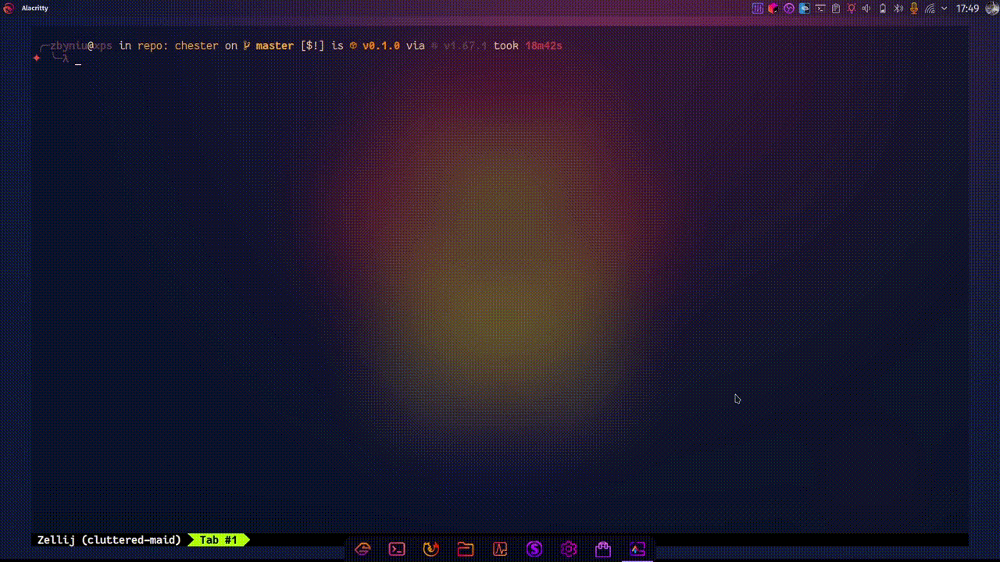

  <h1><code>Always On Tests</code></h1>

  <h3>
    <strong>Live tests status widget</strong>
  </h3>

  

    
  

  <h3>
    <a href="#about">About</a>
     | 
    <a href="#installation">Installation</a>
     | 
    <a href="#configuration">Configuration</a>
     | 
    <a href="#license">License</a>
     | 
    <a href="#contribution">Contribution</a>
  </h3>

<h4>Built with 🦀</h4>

# 
About

AOT purpose is to show live tests results without cognitive break. Whether you
are TDDing your software or refactoring well covered project, AOT allows keeping
your focus on the IDE and at the same time showing the status of the tests (see
the widget in the top right corner in the GIF below).

The test is changed to make tests fail. After save, in the top right corner you
can see the widget starts blinking which means that tests started. After the
tests finish, the widget changes to red which means, that tests failed. Next,
the test is fixed and changes are saved. The widget is blinking and then changes
to green which means the tests passed.

AOT is built upon [chester](https://github.com/devzbysiu/chester). Chester
listens for changes in your project and runs the tests. It also exposes API
which is consumed by AOT.

The widget is created with awesome [eww](https://github.com/elkowar/eww).

# 
Installation

1. Go [here](https://elkowar.github.io/eww/) to see how to install `eww`.

- Put `eww` binary somewhere in `PATH` to make it more convenient to work with.

2. Clone this repository.
3. Copy `eww.scss`, `eww.yuck` and `scripts` to `~/.config/eww/`
4. Check that it's working with `eww open aot` to open tests widget and
   `eww close aot` to close it.

If something is wrong you can use `eww logs` to see the logs.

## --- TODO ---

# 
Configuration

## --- TODO ---

# 
License

This project is licensed under either of

- Apache License, Version 2.0, (LICENSE-APACHE or
  http://www.apache.org/licenses/LICENSE-2.0)
- MIT license (LICENSE-MIT or http://opensource.org/licenses/MIT)

at your option.

# 
Contribution

Unless you explicitly state otherwise, any contribution intentionally submitted
for inclusion in the work by you, as defined in the Apache-2.0 license, shall be
dual licensed as above, without any additional terms or conditions.
